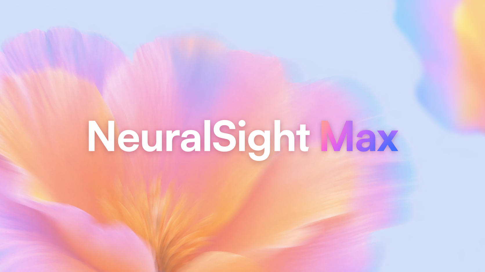

# NeuralSight: Max

**Bridging the gap between human intent and digital autonomy.**

Millions of people with upper limb amputations or severe motor impairments can't access their computers as fully and freely as they want to. Right now, bridging that gap requires thousands of dollars in bulky, specialized hardware.

**We are changing that.** NeuralSight is a dual-modal accessibility suite that delivers total digital autonomy using nothing but a standard everyday webcam and a microphone.

---

## The Vision

### 1. Zero-Hardware Eyetracking
We use lightweight computer vision running locally to track your gaze. Wherever you look on the screen, your pointer follows. An intentional blink is your click. It is fluid, real-time, and completely eliminates the need for a physical mouse.

### 2. Agentic Computer Use
For typing and complex tasks, we built **Max** -- an autonomous, multimodal AI agent that visually interprets the screen's GUI. Give it a voice command, and the agent takes over. It navigates the OS, reasons through application states, and fills out input fields -- bypassing the keyboard entirely. It can even execute intricate system tasks that the user might not know how to do themselves.

---

## Prerequisites
Before you clone and run, ensure you have the following installed:
- **Python 3.10+**: Core logic and UI.
- **Bun**: Required to run the OpenClaude gRPC server.
- **Git**: To clone the repo and its submodules.

---

## Getting Started

### 1. Clone and Install
```powershell
git clone <your-repo-url>
cd NeuralSight
pip install -r requirements.txt
```

### 2. Setup Environment
Rename `.env.example` to `.env` and fill in your keys.

### 3. Launch the Suite
The easiest way to start is using the provided batch script which handles port cleanup and dual-process orchestration:
```powershell
.\start_neuralsight.bat
```

**Manual Execution (for developers):**
If you prefer running the components separately to see detailed logs:

**Terminal 1 (Headless Server):**
```powershell
cd openclaude
.\start_openclaude_server.ps1
```

**Terminal 2 (Voice Interface):**
```powershell
python voice_terminal_pipeline.py
```

---

## Voice Interaction
- **Wake Word**: Say "Max" to activate the assistant.
- **Interruptible**: Say "Max" or "Max, stop" at any time during execution to cancel or redirect the current task.
- **Visual Feedback**: A floating, modern pill UI provides real-time waveform feedback and natural language status updates (e.g., "Thinking...", "Working on it...").

## Neural Architecture: Voice Flow and Triggers

The NeuralSight voice pipeline is engineered for sub-second responsiveness, moving beyond standard linear speech-to-text.

### 1. The Wake-Word Trigger (Max)
Our custom keyword spotting engine utilizes a rolling buffer and phonetic aliasing. It does not just listen for the word "Max"; it monitors for a cluster of phonetic signatures (macs, macks, marx, etc.) that indicate user intent even in noisy environments. 
- **Frequency**: The microphone is sampled every 100ms in the background.
- **VAD (Voice Activity Detection)**: We use a dynamic energy threshold that recalibrates to your room's ambient noise floor in real-time.

### 2. The Command Capture Loop
Once triggered, the pipeline transitions from a "Spotter" to a "Recorder".
- **Dynamic Pause Threshold**: We implemented a 2-second logic buffer. If you pause mid-sentence to think, Max stays active, only closing the recording session when a sustained silence is detected.
- **Groq Acceleration**: Raw audio is streamed directly to our high-speed Groq Whisper layer, delivering 100% accurate transcripts in under 200ms.

### 3. Real-Time Interrupt System
The architecture is inherently non-blocking. While the agent is executing a multi-step task (like navigating a complex website), a secondary thread maintains the "Neural Monitor." 
- **The Baton Pattern**: If you say "Max" while a task is running, the system triggers a gRPC cancellation signal, immediately halting the current process and resetting the state machine for your next command.

---

## The Core: OpenClaude and Windows-MCP

The architecture utilizes a next-generation "headless" control layer that bridges the gap between LLM reasoning and the Windows Kernel.

### OpenClaude: The Agentic Brain
OpenClaude is a stateful gRPC server. It does not just generate text; it maintains a persistent session that can "see" and "reason" about the GUI. It acts as the central nervous system, receiving processed voice transcripts and translating them into high-level system strategies.

### Windows-MCP: The Next-Level Toolkit
Windows-MCP is a specialized Model Context Protocol suite designed to provide the agent with total digital autonomy. This is not a simple automation bridge; it is a deep integration into the Windows OS including:
- **UI Vision Layer**: Allows the agent to snapshot the accessibility tree and visually understand button hierarchies, input fields, and layout states.
- **Kernel-Level Control**: Direct hooks into the process manager, registry, and filesystem for complex system tasks.
- **Browser Prioritization**: A custom logic layer that forces browser interactions to occur via the address bar (ctrl+l), bypassing the unreliability of on-page search boxes.

---

## Key Technologies
- **OpenClaude**: Headless gRPC server for agentic computer control.
- **Groq Whisper**: Ultra-low latency voice transcription (whisper-large-v3-turbo).
- **Windows-MCP**: Direct system integration for 91+ specialized tools (Files, Registry, Browser, UI).
- **CustomTkinter**: Premium, hardware-accelerated Python UI.

---

*NeuralSight: Bringing together human-centric empathy and state-of-the-art agentic workflows. No expensive rigs. Just seamless, fully autonomous computer access.*
